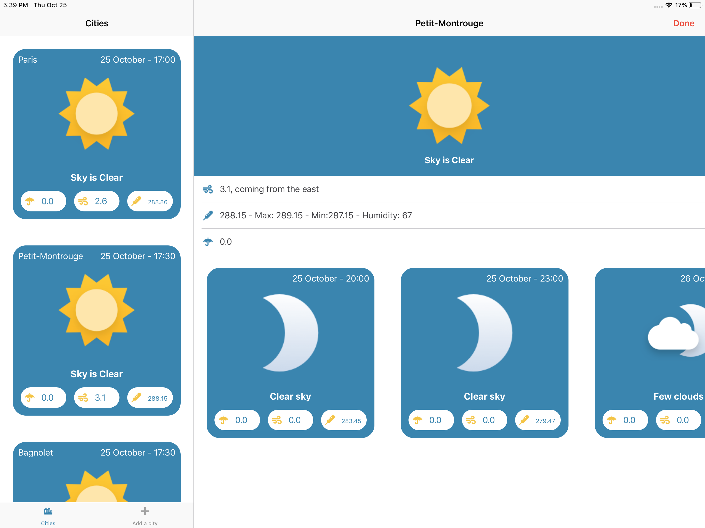
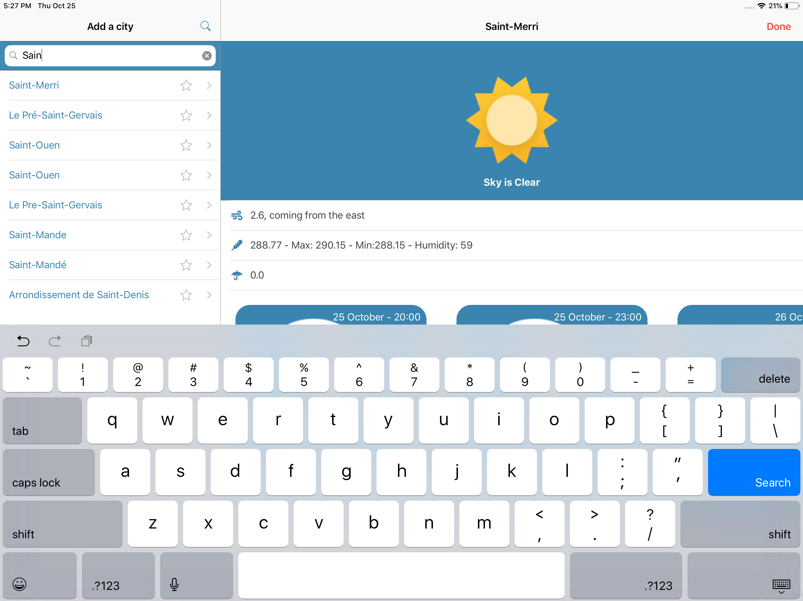
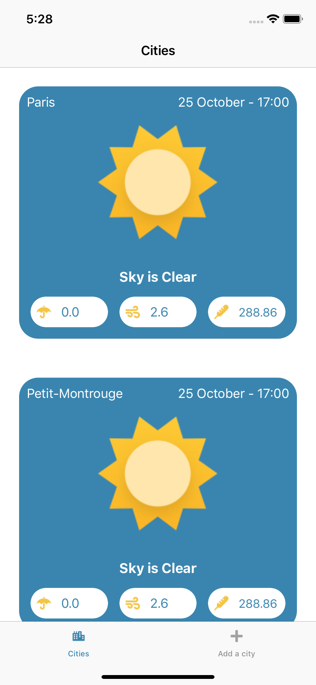
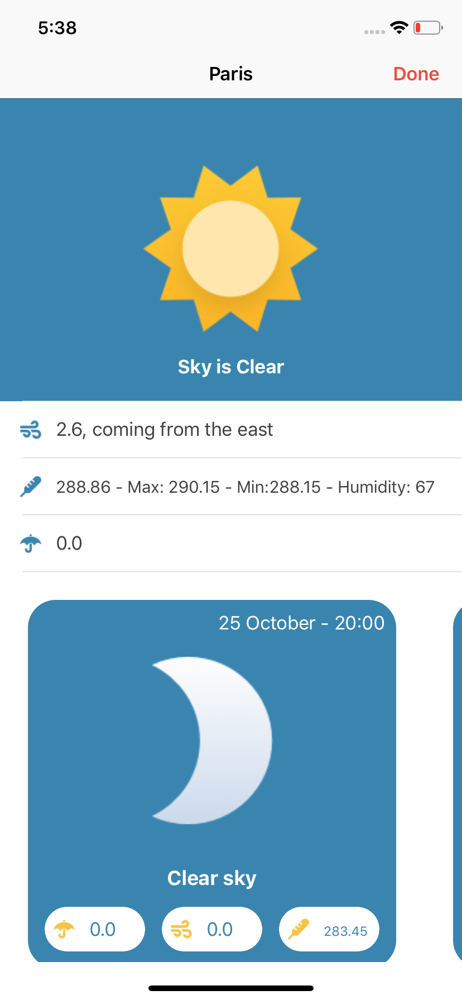
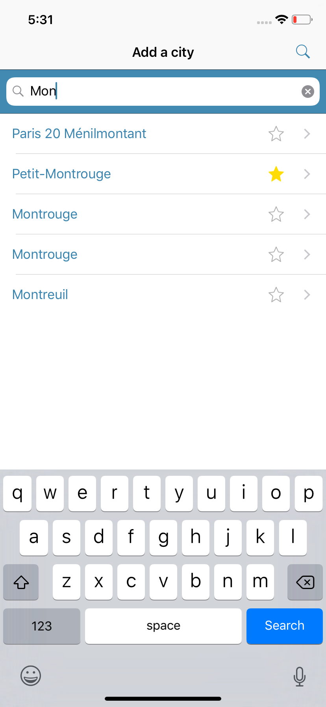

# Forcast

## Used Patterns 

* Realm
  * [Official documentation](https://realm.io/docs/swift/latest/)
* Coordinator Pattern
  * [Talk](https://vimeo.com/144116310)
  * [Article](http://khanlou.com/2015/10/coordinators-redux/)
* Reusable
  * [Library documentation](https://github.com/AliSoftware/Reusable)

## Third party tools

### SwiftGen

> ⚠️  [SwiftGen Install](https://github.com/SwiftGen/SwiftGen/blob/master/README.md)

### SwiftLint

> ⚠️ [SwiftLint Install](https://github.com/realm/SwiftLint/blob/master/README.md)

## Screens

